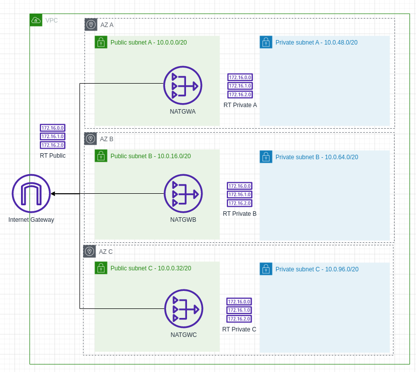

# template-vpc-cloudformation

This is a template for creating a VPC using CloudFormation. It creates a simple structure with 3 public subnets and 3 private subnets. Each subnet is in a different availability zone. The public subnets have a route table with a route to an internet gateway. The private subnets have a route table with a route to a NAT gateway. There are 3 NAT gateways (one in each availability zone) and 3 elastic IPs (one for each NAT gateway) for HA.



## Usage

Create the stack:
```bash
aws cloudformation create-stack --stack-name vpc --template-body file://vpc.yaml
```

Update the stack:
```bash
aws cloudformation update-stack --stack-name vpc --template-body file://vpc.yaml
```

Get the stack events:
```bash
aws cloudformation describe-stack-events --stack-name vpc
```

Delete the stack:
```bash
aws cloudformation wait stack-delete-complete --stack-name vpc
```

## References

- https://jodies.de/ipcalc